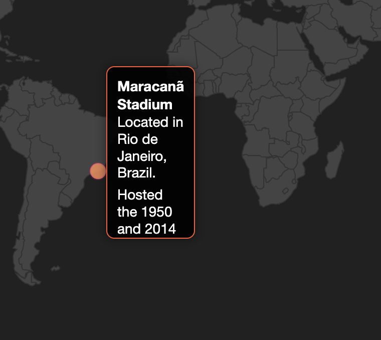
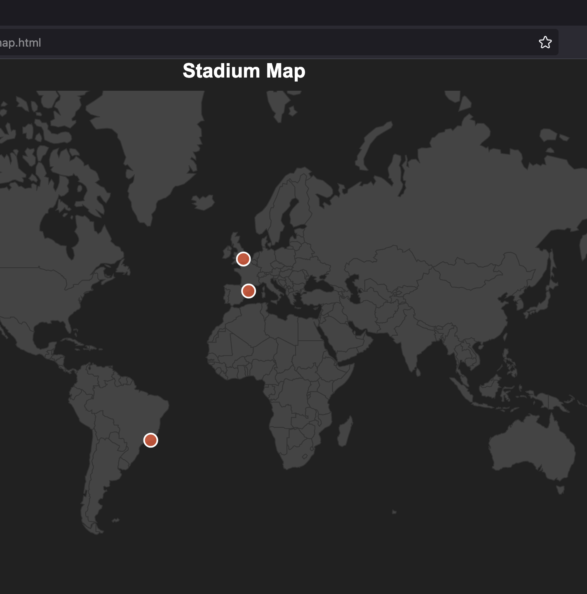

# Stadium Map Documentation

## Overview
The Stadium Map is an interactive visualization displaying stadiums around the world as bubbles on a map. When hovering over a bubble, a popup displays detailed information about the stadium.

## Features
- Displays stadium locations using bubbles.
- Popups show detailed information (e.g., name, location, capacity, and historical facts).
- Easy to add or modify stadium data.

---

## How to Add or Modify Stadiums

### 1. **Modify the Stadium Data**
The `stadiums` data array in the `stadium_map.html` file holds all stadium information. Each stadium entry is an object with the following structure:

```javascript
const stadiums = [
  {
    name: "Stadium Name",        // Name of the stadium
    latitude: XX.XXXX,          // Latitude of the stadium's location
    longitude: YY.YYYY,         // Longitude of the stadium's location
    facts: [                    // Array of interesting facts
      "Fact 1",
      "Fact 2",
      "Fact 3"
    ]
  },
  // Add more stadiums here
];
```

### Example
To add a new stadium:
```javascript
{
  name: "Allianz Arena",
  latitude: 48.2188,
  longitude: 11.6247,
  facts: [
    "Located in Munich, Germany.",
    "Home to FC Bayern Munich.",
    "Capacity: 75,024."
  ]
}
```

Insert the new object into the `stadiums` array.

### Dynamically Generating Stadium Data
If you want to dynamically populate stadium data, you can fetch it from an external API or a local JSON file.

---

## Screenshots

### Stadium Map Overview


### Popup Example


---

## How to Customize the Map

### 1. **Change Bubble Colors**
Modify the `bubbleFill` property in the `fills` configuration:
```javascript
fills: {
  defaultFill: "#444444", // Background color of the map
  bubbleFill: "#00ff00"   // Bubble color
},
```

### 2. **Adjust Bubble Size**
Update the `radius` property for each stadium:
```javascript
radius: 10, // Increase or decrease the bubble size
```

### 3. **Change Map Projection**
The `setProjection` method allows customization of the map's projection, scale, and center. Example:
```javascript
setProjection: function (element) {
  const projection = d3.geo
    .mercator()               // Map projection
    .scale(200)               // Scale of the map
    .translate([
      element.offsetWidth / 2,
      element.offsetHeight / 2
    ]);
  return { path: d3.geo.path().projection(projection), projection };
},
```

---

## Deployment Instructions

### Option 1: Using Python's HTTP Server
1. Run the following command to start a local web server:
   ```bash
   python3 -m http.server
   ```

2. Open your browser and navigate to: `http://localhost:8000/stadium_map.html`

### Option 2: Using `start_server.sh` Script
1. Ensure the `start_server.sh` script is executable:
   ```bash
   chmod +x ./start_server.sh
   ```

2. Run the script:
   ```bash
   ./start_server.sh
   ```

3. Open your browser and navigate to: `http://localhost:8000/stadium_map.html`

---

## Final URL to Check the Result
After deployment, the map will be accessible at the following URL (if hosted locally):
```
http://localhost:8000/stadium_map.html
```

If hosted on a remote server, replace `localhost` with your server's IP or domain.

---

## Future Enhancements
- Add search functionality to locate specific stadiums.
- Allow filtering by region or capacity.
- Animate the bubbles when hovering or loading.

---

For questions or contributions, feel free to reach out!
