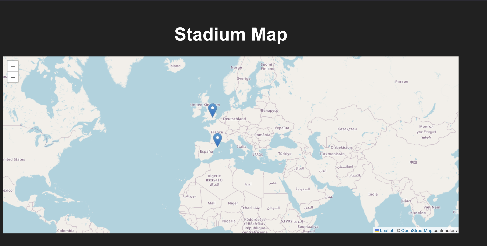

# Stadium Map

This project is an interactive Stadium Map using React and Leaflet. It displays the locations of famous stadiums around the world on an interactive map. Users can hover over the stadium markers to view detailed information about the stadiums.

---

## Features

- Interactive map with React and Leaflet.
- Stadiums displayed as markers.
- Popups showing detailed information for each stadium (name, location, capacity, and historical facts).
- Responsive and modern UI with a dark theme.

---

## Prerequisites

Before you start, make sure you have the following installed on your machine:

- **Node.js** (v16.x or later)
- **npm** (v8.x or later)

---

## Setup

### 1. Clone the repository:
```bash
git clone https://github.com/yourusername/stadium-map.git
```

### 2. Navigate into the project directory:
```bash
cd stadium-map
```

### 3. Install dependencies:
```bash
npm install
```

### 4. Run the development server:
```bash
npm run dev
```
This will start the server on [http://localhost:5173](http://localhost:5173).

---

## Project Structure

```
stadium-map/
├── public/
│   └── index.html            # Main HTML template
├── src/
│   ├── assets/
│   │   └── screen1.png       # Screenshot of the app
│   ├── components/
│   │   └── StadiumMap.jsx    # Component for rendering the map and handling stadiums
│   ├── App.css               # Global styles for the app
│   ├── App.jsx               # Main App component
│   ├── index.css             # Styles for the index page
│   ├── main.jsx              # Main entry point for the React app
├── .gitignore                # Ignored files for Git
├── package.json              # Project configuration and dependencies
├── README.md                 # This file
└── vite.config.js            # Configuration for Vite
```

---

## How to Add or Modify Stadium Data

The stadium data is stored in `src/components/StadiumMap.jsx`. It is an array of objects, where each object represents a stadium.

### Structure of a Stadium Object:
```javascript
{
  name: "Stadium Name",        // Name of the stadium
  latitude: XX.XXXX,           // Latitude of the stadium's location
  longitude: YY.YYYY,          // Longitude of the stadium's location
  facts: [                     // Array of interesting facts
    "Fact 1",
    "Fact 2",
    "Fact 3"
  ]
}
```

### Example of Adding a New Stadium:
```javascript
{
  name: "Allianz Arena",
  latitude: 48.2188,
  longitude: 11.6247,
  facts: [
    "Located in Munich, Germany.",
    "Home to FC Bayern Munich.",
    "Capacity: 75,024."
  ]
}
```

To add a new stadium, simply insert this object into the `stadiums` array within `StadiumMap.jsx`.

---

## How to Customize the Map

### 1. Change Map Background Color

To make the map’s background black, modify `src/index.css`:
```css
.leaflet-container {
  background-color: #212121; /* Black background */
}
```

### 2. Change Marker Colors

To make the markers blue, add this to your `src/index.css`:
```css
.leaflet-marker-icon {
  background-color: blue;
}
```

To customize the popup, use the following CSS in `src/index.css`:
```css
.leaflet-popup-content-wrapper {
  background-color: rgba(0, 0, 0, 0.85); /* Transparent black background */
  border: 2px solid #ff5733;
  border-radius: 10px;
}

.leaflet-popup-content {
  color: white;
  font-family: Arial, sans-serif;
  font-size: 14px;
  padding: 10px;
}
```

---

## Deployment

To deploy your app to a hosting service, follow these steps:

### 1. Build the app for production:
```bash
npm run build
```

### 2. Deploy the `dist/` folder to your hosting provider.

You can use platforms like **Vercel**, **Netlify**, or any static site hosting service.

---

## Screenshot



---

## Future Enhancements

- Add a search feature to locate specific stadiums on the map.
- Allow filtering of stadiums by region or capacity.
- Add dynamic data loading via APIs.
- Animate the markers when hovered or clicked.

---

## Technologies Used

- **React** for the UI.
- **Leaflet** for the interactive map.
- **Vite** for the development environment and build system.
- **CSS** for styling.

---

## Contact

For questions or contributions, feel free to reach out:

- **GitHub:** [@felipedbene](https://github.com/felipedbene)
